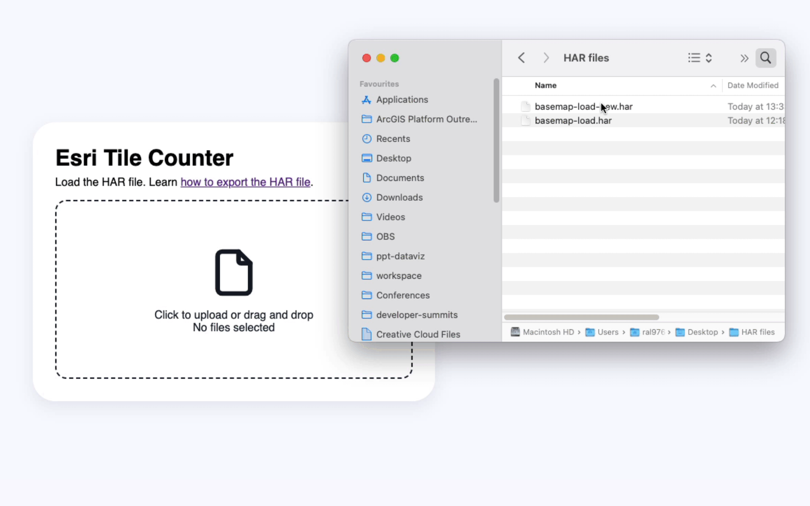

# esri-tile-counter

Explore the network request (HAR file) a discover how many tiles where used, and how many came from the browser cache.

**Demo**: [https://hhkaos.github.io/esri-tile-counter](https://hhkaos.github.io/esri-tile-counter)

Did you find a bug or want to suggest an enhancement? Let me know in [the issues](https://github.com/hhkaos/esri-tile-counter/issues?q=sort%3Aupdated-desc+is%3Aissue+is%3Aopen).